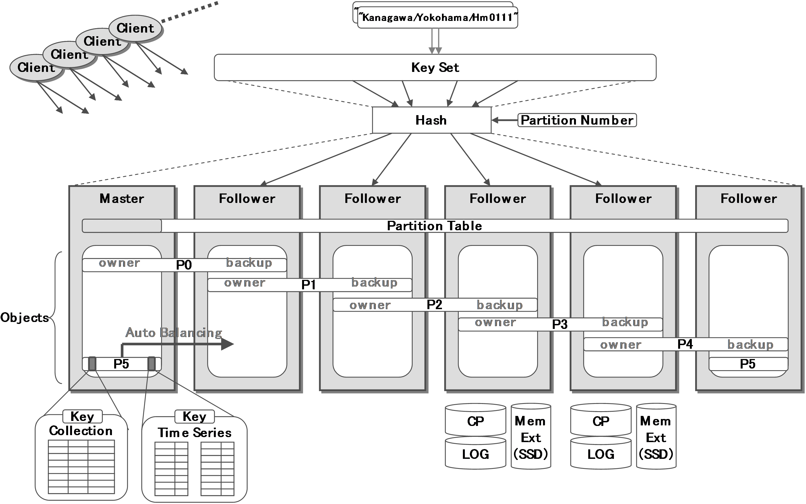
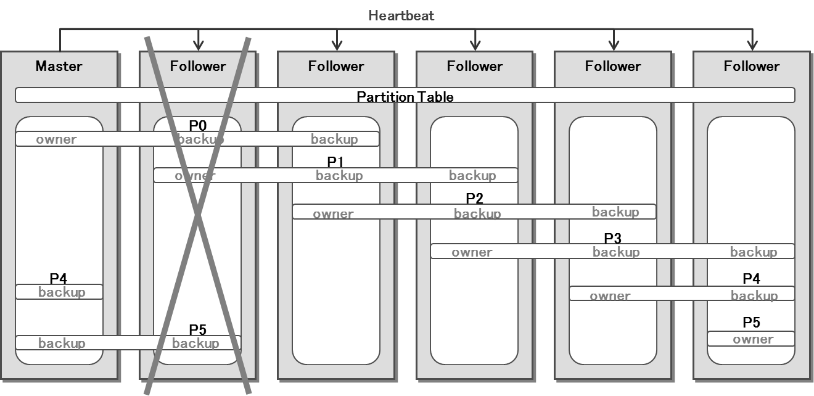
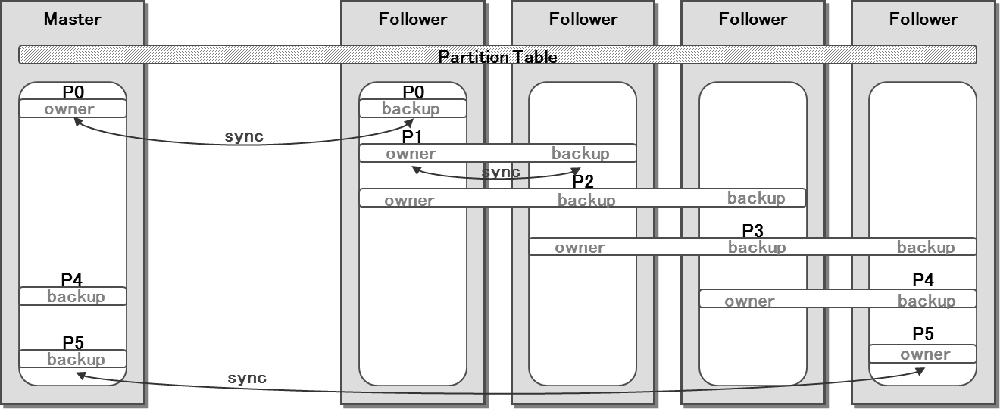

# GridDB Technical Design Document Version 1.0

## 1. GridDBクラスタの概念図

分散キーバリュー型データベースは、複数のキーバリュー型データベースノードを用いることで、単一のキーバリュー型データベースノードでは対応できない大量のデータを扱うことができる。
GridDBは、分散キーバリュー型データベースの一つである。

GridDBのバリューは、コンテナと呼ばれる。コンテナはロウと呼ばれるデータの集合を管理する入れ物である。コンテナにはコレクションとタイムシリーズの2種類が存在する。GridDBにおけるキーは、コンテナに対する主キーになる。

複数のデータベースノードを並べることでDBクラスタを構成する。クラスタはマスタースレーブ型とピアツーピア型の2種類に分類される。

###### マスタースレーブ型：
クラスタを管理するマスターノードと、データを保管する複数のデータベースノード(スレーブに相当)と、から構成されるクラスタである。マスターノードが単一障害点となるため、クラスタの可用性を確保するためにはマスターノードを冗長化する必要がある。また、データベースノード数が増加すると、マスターノードの負荷が高くなる、といった問題点がある。

###### ピアツーピア型：
DBクラスタを構成する全てのノードが同じ機能を持つホモジニアスなクラスタである。断片的なノード情報に従って各ノードが動作するので、マスタースレーブ型と比較して、データ再構成は最適化されにくい。また、ノード間のオーバヘッドが大きい、といった問題点がある。

GridDBは、マスタースレーブ型とピアツーピア型のハイブリッド方式を採用している。DBクラスタを構成する全てのノードが同じ機能を持つホモジニアスなクラスタである。マスターノードは、DBクラスタが組まれたときに自律的に決定される。それ以外のノードはフォロワーノードと呼ばれる。マスターノードがダウンすると、生き残ったノードから新たなマスターノードが決定される。

なお、ネットワーク分割によるスプリットブレイン問題を回避するため、DBクラスタはクォーラム以上のノード数から構成されていなければならない。

パーティションとは、コンテナを格納する論理的な領域であり、ユーザからは直接は見えない。全てのコンテナは主キーに対するハッシュ値を用いて、パーティション集合のいずれかに属する。パーティション数は、クラスタごとに事前に設定し、全てのノードで同じ値でなければならない。この設定値は、予想されるノード数の数倍程度を目安とする。

それぞれのパーティションに対して、1つのオーナーノードと、複数のバックアップノードが存在する。さらにキャッチアップノードと呼ばれる将来的にバックアップノードとするためのノードが存在することもある。

オーナーノードとは、コンテナを更新することが出来るノードである。バックアップノードとは、コンテナのレプリカを保持し、コンテナに対して参照のみが可能なノードである。

パーティションに対するノードの割当表のことを、パーティションテーブルと呼ぶ。マスターノードは、パーティションテーブルを作成した後、それをフォロワーノードやクライアントライブラリに配布する。このパーティションテーブルを参照することで、コンテナのオーナーノードやバックアップノードを知ることができる。

## 2. マスターノードの決定
### 2.1. 起動時のマスターノード決定手順

GridDBでは、ブリ―アルゴリズムを用いて、自律的にマスターノードを決定する。

ノード間で選任メッセージを送受信しており、自分より強いノードからのメッセージを受信した時点で相手を選任する応答を返し、自分はそれ以降のメッセージ送受信を終了する。この手続きを繰り返すことで、最終的に一つのノードだけが勝ち残る。このノードがマスターノード、この手続き中に敗者となったノードがフォロワーノードとなりクラスタが構成される。ノード数をNとした場合、本アルゴリズムにおける通信段数は、平均logNとなる。

マスターノードは定周期のハートビートにより全フォロワーノードの情報を収集している。この通信コストはフォロワーノード数に依存する。ハートビートは、デフォルトでは5秒間隔であるが、ノード数やネットワークトラフィックに応じて適宜調整しても良い。

### 2.2. マスターノードダウン時の次マスターノード決定

 クラスタ内のマスターノードがダウンした場合、残ったフォロワーノードの中から自律的に新たなマスターノードが決定される。

 フォロワーノードは、マスターノードに対するハートビートが断絶した時点で、クラスタ構成はリセットされる。以後は、2.1で述べた手順により、新たなマスターノードが決定される。

## 3. パーティションのロール決定
### 3.1. オーナーノードとバックアップノード

パーティションのバックアップノードの数は、レプリカ数というパラメータで指定できる。レプリカ数1がオーナーノードのみの指定であり、レプリカ数2以上で(レプリカ数 - 1)個のバックアップノードが設定される。

パーティションにバックアップノードが存在する場合、オーナーノードでのデータ更新は直ちに全てのバックアップノードへレプリケーションされる。

レプリケーションの方法は、非同期または準同期が選択できる。非同期では、オーナーノードでの更新内容をバックアップノードへ送信した時点で更新処理完了となる。準同期では、更新内容をバックアップノードに送信し、バックアップノードからの受信応答を確認した後で更新処理完了となる。更新処理性能では非同期が優れ、可用性では準同期のほうが優れる。

オーナーノードでの更新を全てのバックアップノードに対してレプリケーションするので、バックアップノード数に比例した処理コストがかかる。オーナーノードのみ・バックアップノードなしでの更新処理性能を100とすると、バックアップノード数1・非同期レプリケーションでの更新処理性能はおよそ70、バックアップノード数1・準同期レプリケーションでの更新処理性能はおよそ50となる。

ハートビートで障害発生を監視しており、パーティションのオーナーノードまたはバックアップノードを担当するノードでの障害発生を検知した場合、フェイルオーバーが行われる。

障害発生したノードがパーティションのオーナーノードであった場合は、マスターノードはバックアップノードから新たなオーナーノードを決定する。障害発生したノードがバックアップノードであった場合は、マスターノードは障害発生したバックアップノードをパーティションから切り離し、残ったバックアップノードで処理を継続する。

マスターノードは、新たにパーティションテーブルを更新し、新たなオーナーノード、バックアップノードに対して配布する。新たなオーナーノード、バックアップノードはそれに従ってノード間でデータの同期を行い、更新ログのタイムスタンプが一致していることを確認した後、オーナーノード、バックアップノードとして設定される。この処理のことを短期同期と呼ぶ。

レプリケーションによってオーナーノードの更新内容は逐次バックアップノードへ反映されているため、短期同期において同期すべきデータ量は僅かであり、通常数秒で完了する。

⇓

### 3.2. キャッチアップノードの決定

キャッチアップノードとは、パーティションに対するノードの割り当てのうち、将来的にバックアップノードとするためのノードであり、以下の様な場合に設定される。

・レプリカ数に対してバックアップノード数が不足している。
・ノード間でパーティションのオーナーノード、バックアップノードの担当個数に偏りがある。

マスターノードは上記の場合を解消するようにキャッチアップノードを決定する。その後、オーナーノードからキャッチアップノードへデータイメージ及び更新ログを送信させることで、キャッチアップノードの持つデータのタイムスタンプをオーナーノードの持つタイムスタンプへ近づける。

マスターノードは、オーナーノードとキャッチアップノードのタイムスタンプの差が一定値以内になった時、オーナーノードとキャッチアップノード間で短期同期を実行する。これにより、新たにバックアップノードが作成される。

オーナーノードからキャッチアップノードへデータの送信を開始してから、バックアップノードに設定されるまでの期間は、おおよそ数時間程度かかる。

## 4. クライアントライブラリの動作

クライアントライブラリ(以下、クライアント)は、アプリケーションからのデータ操作要求に応じてアクセスすべきデータベースノードを特定し、ステートメントと呼ぶ実行単位で処理を依頼する。

ステートメントの実行に至る手順は以下のとおりである。まず、マスターノードからの定期的なマルチキャストによる通知を受け取り、マスターノードを特定する。続いて、操作対象のコンテナの主キーに対するハッシュ値に基づき、パーティションを特定する。さらに、マスターノードのパーティションテーブルを参照してデータベースノードを特定し、ステートメントを実行する。

一度入手したマスターノードの情報やパーティションテーブルの内容は、ステートメント実行の際にエラーにならない限りキャッシュを維持する。また、一度確立したデータベースノードへの接続は、コネクションプールにより保持し続ける。これにより、マスターノードへの問い合わせ回数やデータベースノードの接続回数を最小限に抑えることができる。

クライアントは、障害に対する透過性を保証するために、クライアントフェールオーバ機構を備える。ステートメント実行の際に接続障害やクライアントがキャッシュしたパーティションテーブルの内容との不一致が発覚した場合、キャッシュを無効にし、ステートメントの再実行に成功するまでやり直す。あらかじめ設定した時間を経過しても成功しない場合は、アプリケーション側にエラーを返す。

## 5. ノード追加の手順

GridDBでは、新規追加ノードを起動することで、自動的に既存クラスタに追加できる。
新規ノードは、クラスタに追加された直後はデータを持たない。しかし、マスターノードがこのノードを3.2で述べたキャッチアップノードに指定することにより、自動的に他ノードの保持するデータが分配される。その後、バックアップノードに昇格した時点で結果としてノード間の負荷が平準化される。

これにより、クラスタを停止させることなくスケールアウトさせることが可能となる。但し、データ分配は長期間に及ぶので、移行時間を見据えた運用を行う必要がある。
